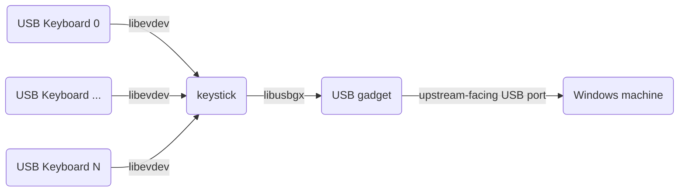

# keystick

This program uses a linux machine A to translate keypresses of physically connected keyboards to virtual USB joysticks that appear to a USB host connected to A's device-capable USB port.

This program is intended to run on a raspberry pi (tested on a pi4). Connect as many keyboards as you need, then power up the pi and let keystick.service start the keystick binary. The program will then use libevdev to enumerate attached keyboards and use libusbgx to create a virtual joystick for each using the linux USB Gagdet API.

# motivation

I like playing Atomic Bomberman. Unfortunately, it only supports 2 players using keyboards, while the remaining players have to use joysticks. Usually, there are way more keyboards than joysticks around, and even if not, using joysticks for Bomberman sucks.

# installation (from memory...)

- install raspberrypios on your rpi4
- `apt install build-essential git cmake libusbgx-dev libevdev-dev libconfig-dev libfmt-dev`
- `cd && git clone https://github.com/benadler/keystick`
- `pushd keystick && mkdir build && pushd build && cmake .. && make install -j4 && popd && popd`
- `sudo cp keystick.service /etc/systemd/system && systemctl enable keystick`

# usage

Connect all keyboards and then power up the pi; `keystick` can't deal with keyboards (dis)connecting during runtime, they all have to be static after startup.

Each joystick has 2 axes which are controlled by a keyboard's arrow keys and 8 buttons controlled using - in order - `F`, `D`, `S`, `A`, `V`, `C`, `X`, `Z` keys. If you want to change that, modify `devicehid.cpp` to advertise more/less axes/buttons *and* `keyboardjoystick.cpp` to report the key-changes properly.

# related tools

- https://github.com/milador/RaspberryPi-Joystick emulates just one joystick (I think?) and its keys tended to get stuck sometimes. Since I can't write a line of python I didn't investigate further.
- https://sourceforge.net/projects/vjoystick/, PPJoy, KeyboardSplitterXbox and friends didn't work for me. Most were a bit older, needed installation of unsigned drivers and whatnot. Not saying they don't work, I might have done insufficient homework.
- https://www.rewasd.com is commercial. Haven't checked if it supports translating multiple physical keyboards to multiple virtual joysticks.

# limitations

- Since a raspberry pi 4 is powered through the same USB port that's connected to the upstream machine, that'll have to supply enough current. I haven't run into issues, but maybe something like https://www.elmorlabs.com/product/usb-c-power-data-switch-for-raspberry-pi-4/ could be required.

# license

I don't know what's appropriate. This is just glue code between libevdev (MIT?) and libusbgx (LGPL and GPL). So, maybe LGPL.
